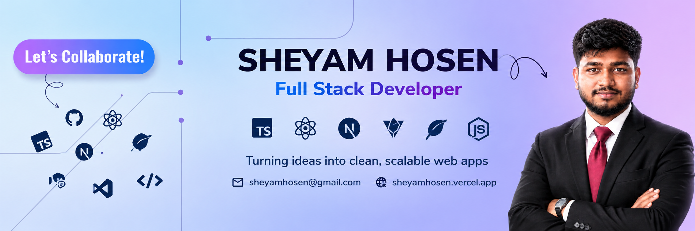

  

 

<h1 align="center">
  Hi 👋, I'm Mohammad Sheyam Hosen
</h1>

 

- 👋 Hi, I’m [@sheyam-hosen](https://github.com/sheyam-hosen)
- 💻 I’m currently working on **React.js, TypeScript and Modern Web Development.**
- ⚛️ Building **responsive and user-friendly web applications** with React.
- 🟢 Currently learning **Node.js, Express.js and Full-Stack Development.**
- 🛠️ Improving my skills in **JavaScript, React, TypeScript and Backend Development.**
- 💬 Ask me about **HTML, CSS, JavaScript, React, TypeScript and Responsive Web Design.**
- 📚 I’m continuously learning and building **real-world projects.**
- 🚀 My goal is to become a **strong Full-Stack Developer.**
- 📧 Feel free to reach me out [Email](mailto:mohammadsiam756@gmail.com)

---

## 🛠️ Tech Stack

### 🎨 Frontend

  
  
  
  
  
  

### ⚙️ Backend

  

### 🔧 Tools

  
  
  

---

## 🚀 What I'm Working On

- 💻 Modern Web Development Projects
- ⚛️ React Applications
- 🟦 TypeScript Projects
- 🟢 Node.js & Backend Development
- 📱 Responsive Web Design
- 🚀 Full-Stack Development

---

## 🌐 Connect With Me

---

## 📊 GitHub Activity

  

---

## 🔥 GitHub Streak

  

---

## 👀 Profile Views

  

---

## 🎯 My Goals

- 🚀 Become a strong Full-Stack Developer
- 💻 Build real-world web applications
- ⚛️ Master React & TypeScript
- 🟢 Improve Node.js & Backend Development
- 🌎 Contribute to Open-Source Projects
- 📚 Keep learning new technologies

---

## ⚡ Fun Fact

> I enjoy turning ideas into modern and functional websites. 🚀

---

<h3 align="center">
  🚀 Turning Ideas Into Modern Web Experiences
</h3>

  Thanks for visiting my profile! ❤️

